<div align="center">
  
</div>

<br />

<table width="100%">
  <tr>
    <td width="62%" valign="top">
      <h2>Dalil Mukhitov</h2>
      <p>
        <b>Enterprise Systems Management Engineer</b><br />
        I build, automate and stabilize corporate infrastructure: endpoints, identity, updates, messaging, deployment pipelines and the little internal tools that stop people from clicking through the same dead wizard for the 400th time.
      </p>
      <p>
        My work lives somewhere between <b>Microsoft infrastructure</b>, <b>automation</b>, <b>application packaging</b>, <b>reporting</b> and <b>quietly preventing production from becoming a campfire</b>.
      </p>
    </td>
    <td width="38%" valign="top">
      <br />
      <table width="100%">
        <tr><td><code>STATUS</code></td><td align="right"><b>operational</b></td></tr>
        <tr><td><code>MODE</code></td><td align="right">automation-first</td></tr>
        <tr><td><code>DOMAIN</code></td><td align="right">enterprise systems</td></tr>
        <tr><td><code>BIAS</code></td><td align="right">boring reliability</td></tr>
        <tr><td><code>ENEMY</code></td><td align="right">manual routine</td></tr>
      </table>
    </td>
  </tr>
</table>



## Operating range

<table width="100%">
  <tr>
    <td width="25%" valign="top">
      <h3>Endpoint control</h3>
      <p>MECM / SCCM, task sequences, OSD, ADR, WSUS, baselines, collections, inventory, compliance.</p>
    </td>
    <td width="25%" valign="top">
      <h3>Automation</h3>
      <p>PowerShell, Python, deployment logic, repeatable admin workflows, internal tooling, glue code.</p>
    </td>
    <td width="25%" valign="top">
      <h3>Microsoft stack</h3>
      <p>Active Directory, GPO, Exchange, Exchange Online, Microsoft 365, SharePoint, Azure-side plumbing.</p>
    </td>
    <td width="25%" valign="top">
      <h3>Reporting</h3>
      <p>SQL reports, inventory views, patch compliance, operational dashboards, ugly data made less criminal.</p>
    </td>
  </tr>
</table>

<div align="center">
  
</div>

## Current build

```txt
┌─ identity ─────────────────────────────────────────────────────────────┐
│ name        : Dalil Mukhitov                                           │
│ handle      : Mukhitow                                                 │
│ role        : Enterprise Systems Management Engineer                   │
│ focus       : endpoint management, automation, infrastructure control  │
│ principle   : make it stable, make it repeatable, then document it     │
└───────────────────────────────────────────────────────────────────────┘
```

## What I actually do

```powershell
$Work = @(
  "turn broken deployment chains into predictable workflows",
  "package annoying applications until they behave in Software Center",
  "build reports that show reality, not management-friendly astrology",
  "automate user, device, software and patch operations",
  "document systems before tribal knowledge becomes a hostage situation",
  "connect Microsoft services without sacrificing another admin to the logs"
)

$Work | ForEach-Object { "[OK] $_" }
```

## Technical surface

<table width="100%">
  <tr>
    <th align="left">Layer</th>
    <th align="left">Tools / systems</th>
    <th align="left">Typical output</th>
  </tr>
  <tr>
    <td><b>Endpoint management</b></td>
    <td>MECM / SCCM, WSUS, ADR, OSD, Task Sequences</td>
    <td>controlled deployments, update rings, compliance baselines</td>
  </tr>
  <tr>
    <td><b>Automation</b></td>
    <td>PowerShell, Python, REST APIs, scheduled jobs</td>
    <td>repeatable operations, admin tooling, less button-clicking misery</td>
  </tr>
  <tr>
    <td><b>Identity</b></td>
    <td>Active Directory, GPO, Entra ID / Azure AD</td>
    <td>users, groups, policy, access, lifecycle cleanup</td>
  </tr>
  <tr>
    <td><b>Messaging</b></td>
    <td>Exchange Server, Exchange Online, mail flow</td>
    <td>mail routing, transport rules, mailbox operations</td>
  </tr>
  <tr>
    <td><b>Cloud workplace</b></td>
    <td>Microsoft 365, SharePoint, OneDrive, Teams</td>
    <td>service administration, permissions, recovery, governance</td>
  </tr>
  <tr>
    <td><b>Packaging</b></td>
    <td>MSI, EXE, detection scripts, silent install logic</td>
    <td>deployable applications instead of vendor-generated punishment</td>
  </tr>
  <tr>
    <td><b>Reporting</b></td>
    <td>SQL, Report Builder, inventory data, dashboards</td>
    <td>patch status, software inventory, device health, management visibility</td>
  </tr>
  <tr>
    <td><b>Internal tools</b></td>
    <td>HTML, CSS, JavaScript, Docker, lightweight web apps</td>
    <td>portals, launchers, dashboards, operator-friendly interfaces</td>
  </tr>
</table>

## Projects on the bench

<table width="100%">
  <tr>
    <td width="33%" valign="top">
      <h3><a href="https://github.com/Mukhitow/Home">Home</a></h3>
      <p>Browser homepage / internal control surface concept. A place for links, quick actions, dashboards and daily operator context without turning the browser into a landfill.</p>
      <p><code>HTML</code> <code>CSS</code> <code>JavaScript</code></p>
    </td>
    <td width="33%" valign="top">
      <h3><a href="https://github.com/Mukhitow/MoneyFlow">MoneyFlow</a></h3>
      <p>Personal finance / flow tracking experiment. Small, direct, browser-based tooling because sometimes Excel deserves to rest in the swamp it came from.</p>
      <p><code>JavaScript</code> <code>PWA</code> <code>HTML</code></p>
    </td>
    <td width="33%" valign="top">
      <h3><a href="https://github.com/Mukhitow/Mukhitow">Profile</a></h3>
      <p>This repository. A controlled landing zone for identity, work surface, technical direction and visible proof that a README does not have to look like a bootcamp certificate.</p>
      <p><code>Markdown</code> <code>SVG</code> <code>GitHub Profile</code></p>
    </td>
  </tr>
</table>

## The way I prefer systems

```txt
Manual checklist repeated daily     -> automation candidate
Vendor installer with no silent mode -> packaging target
Dashboard with no decision value     -> decorative corpse
Undocumented critical process        -> future incident with a calendar invite
```

## Field notes

<details>
  <summary><b>Infrastructure philosophy</b></summary>
  <br />
  <p>
    Reliable systems should be boring. Not weak. Not primitive. Boring.
    Boring means the deployment runs the same way every time, the report says something useful,
    the access model is understandable, and the next admin does not need archaeology tools to change one setting.
  </p>
</details>

<details>
  <summary><b>Things I like building</b></summary>
  <br />
  <ul>
    <li>Deployment scripts that fail loudly instead of lying politely.</li>
    <li>Reports that expose the real state of devices, users, updates and software.</li>
    <li>Internal portals for support teams, operators and tired admins with too many tabs.</li>
    <li>Task sequences and tools that turn chaos into a button with consequences.</li>
    <li>Documentation that can survive staff turnover, amnesia and meetings.</li>
  </ul>
</details>

<details>
  <summary><b>Things I try not to build</b></summary>
  <br />
  <ul>
    <li>One-off scripts with hardcoded corpses hidden in the middle.</li>
    <li>Dashboards that look expensive but answer nothing.</li>
    <li>Automation that needs more babysitting than the manual process.</li>
    <li>Architecture diagrams that were clearly made to impress someone who never opens logs.</li>
  </ul>
</details>

## Contact

<p>
  <a href="https://www.linkedin.com/in/mukhitow"><b>LinkedIn</b></a>
  ·
  <a href="https://github.com/Mukhitow"><b>GitHub</b></a>
</p>

```txt
If it can be automated, it probably should be.
If it cannot be automated, it should at least be documented.
If it is neither automated nor documented, congratulations: you own a ritual.
```

<div align="center">
  
</div>
