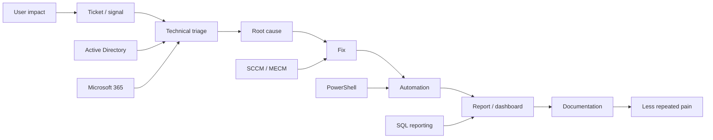

<!--
  Mukhitow profile README
  Single-file edition. No external images. No generated badge circus.
-->

<div align="center">

<pre>
███╗   ███╗██╗   ██╗██╗  ██╗██╗  ██╗██╗████████╗ ██████╗ ██╗    ██╗
████╗ ████║██║   ██║██║ ██╔╝██║  ██║██║╚══██╔══╝██╔═══██╗██║    ██║
██╔████╔██║██║   ██║█████╔╝ ███████║██║   ██║   ██║   ██║██║ █╗ ██║
██║╚██╔╝██║██║   ██║██╔═██╗ ██╔══██║██║   ██║   ██║   ██║██║███╗██║
██║ ╚═╝ ██║╚██████╔╝██║  ██╗██║  ██║██║   ██║   ╚██████╔╝╚███╔███╔╝
╚═╝     ╚═╝ ╚═════╝ ╚═╝  ╚═╝╚═╝  ╚═╝╚═╝   ╚═╝    ╚═════╝  ╚══╝╚══╝
</pre>

### Enterprise Systems Management Engineer

`endpoint management` · `automation` · `windows infrastructure` · `internal tooling` · `controlled chaos`

</div>

---

<table>
<tr>
<td width="58%" valign="top">

```console
C:\infra> whoami /profile

User        : Mukhitov Dalil
Handle      : Mukhitow
Role        : Enterprise Systems Management Engineer
Mode        : calm until production starts screaming
Speciality  : making enterprise systems less embarrassing

C:\infra> status

[OK] endpoint management
[OK] automation
[OK] packaging weird software nobody documented
[OK] mail / identity / Microsoft 365 pain management
[OK] reports that expose ugly truth instead of hiding it
[!!] vendor documentation quality remains a public health issue
```

</td>
<td width="42%" valign="top">

### What this place is

Not a trophy wall. Not a LinkedIn motivational landfill.  
This is a small public window into the kind of work that usually lives behind VPNs, ticket systems, broken portals, and change requests written like ancient curses.

I work around enterprise infrastructure, endpoint management, automation, internal tools, and the special category of software that technically exists but should probably apologize.

</td>
</tr>
</table>

---

## Operating area

<table>
<tr>
<td valign="top" width="33%">

### Endpoint control

- Microsoft Configuration Manager / MECM / SCCM
- WSUS, ADR, update rings
- Task Sequences and OSD
- Compliance baselines
- Hardware and software inventory
- Deployment logic that does not die on first contact with reality

</td>
<td valign="top" width="33%">

### Infrastructure

- Active Directory
- Group Policy
- DNS / DHCP
- Windows Server
- Microsoft 365 / Exchange Online
- SharePoint / OneDrive administration
- Identity, access, mail flow, and all the other quiet disasters

</td>
<td valign="top" width="33%">

### Automation & tooling

- PowerShell first
- Python when PowerShell starts looking like a hostage note
- SQL for reports
- Docker for internal services
- HTML / CSS / JS for tools people can actually use
- Grafana / Report Builder dashboards

</td>
</tr>
</table>

---

## Command palette

| Command | Output |
|---|---|
| `profile --short` | Infrastructure engineer focused on endpoint management, automation, and internal tooling. |
| `stack --core` | SCCM, PowerShell, AD, GPO, WSUS, Microsoft 365, Exchange, SQL, Docker. |
| `mode --default` | Fix the system, document the fix, automate the next failure. |
| `debug --style` | Logs first. Assumptions later. Panic never helped a dead service. |
| `docs --philosophy` | If nobody can repeat the fix, it was not fixed. It was a ritual. |
| `meetings --filter` | Reject vague noise. Accept clear problems, owners, dates, rollback plans. |

---

## Architecture map



---

## Things I usually build

<table>
<tr>
<td width="50%" valign="top">

### Useful internal crap

- Admin dashboards
- Software catalog views
- Update compliance reports
- Device cleanup tools
- Deployment helpers
- Inventory views
- Small web apps that replace Excel necromancy

</td>
<td width="50%" valign="top">

### Operational scripts

- User and device maintenance
- Detection methods
- Silent install / uninstall flows
- Exchange and Microsoft 365 checks
- AD cleanup routines
- Report data extraction
- Logs collection without making humans suffer more than legally required

</td>
</tr>
</table>

---

## Public repositories

| Repository | Purpose |
|---|---|
| [`Home`](https://github.com/Mukhitow/Home) | Personal / internal homepage experiments. One clean entry point instead of browser tab landfill. |
| [`MoneyFlow`](https://github.com/Mukhitow/MoneyFlow) | Finance flow tracking experiment. Because money also deserves logs before it disappears. |
| [`Mukhitow`](https://github.com/Mukhitow/Mukhitow) | This profile. The front door. Try not to trip over the cables. |

---

## Working principles

```text
01. Production does not care about beautiful theories.
02. If the rollback plan is "we will see", the plan is garbage.
03. Dashboards must answer questions, not decorate walls.
04. Automation without logging is just faster chaos.
05. Documentation must survive the person who wrote it.
06. A deployment is not successful until detection proves it.
07. The best tool is the one people actually use after you leave the room.
```

---

## Toolchain, without perfume

<table>
<tr>
<td valign="top" width="25%">

**Management**

`SCCM`  
`MECM`  
`WSUS`  
`Intune logic`  
`Task Sequences`

</td>
<td valign="top" width="25%">

**Automation**

`PowerShell`  
`Python`  
`SQL`  
`REST APIs`  
`scheduled jobs`

</td>
<td valign="top" width="25%">

**Microsoft stack**

`AD`  
`GPO`  
`Exchange`  
`Microsoft 365`  
`SharePoint`

</td>
<td valign="top" width="25%">

**Tools**

`Docker`  
`IIS`  
`Grafana`  
`Report Builder`  
`Git`

</td>
</tr>
</table>

---

<details>
<summary><b>Field notes</b></summary>

<br>

```text
Enterprise IT is mostly archaeology.
You dig through logs, old policies, forgotten scripts, mystery GPOs,
registry leftovers, dead documentation, and vendor installers that behave
like they were assembled during a fire drill.

The trick is not to look heroic.
The trick is to make the next incident boring.
```

</details>

<details>
<summary><b>What I avoid</b></summary>

<br>

- Fake productivity theater
- Dashboards with no operational value
- Scripts that only work on the author's laptop
- Documentation that says "just run the tool" and then dies
- Manual processes pretending to be governance
- Vendor defaults accepted as religion

</details>

<details>
<summary><b>What I respect</b></summary>

<br>

- Clear ownership
- Reversible changes
- Small tools that remove repeated pain
- Logs that tell the truth
- Boring infrastructure
- People who test before touching production like civilized animals

</details>

---

## Current direction

```console
C:\projects> tree /focus

.
├── endpoint-management
│   ├── update-rings
│   ├── application-packaging
│   ├── compliance-baselines
│   └── reporting
│
├── internal-tools
│   ├── homepage
│   ├── dashboards
│   ├── admin-portals
│   └── automation-ui
│
└── documentation
    ├── runbooks
    ├── recovery-guides
    ├── operational-standards
    └── diagrams-that-do-not-insult-the-reader
```

---

## Contact

<table>
<tr>
<td width="70%">

For infrastructure, automation, internal tooling, endpoint management, or strange enterprise systems that need adult supervision.

</td>
<td align="right" width="30%">

[`LinkedIn`](https://linkedin.com/in/mukhitow) · [`GitHub`](https://github.com/Mukhitow)

</td>
</tr>
</table>

---

<div align="center">

```text
stable systems > loud promises
clean rollback > heroic recovery
boring operations > dramatic outages
```

</div>
